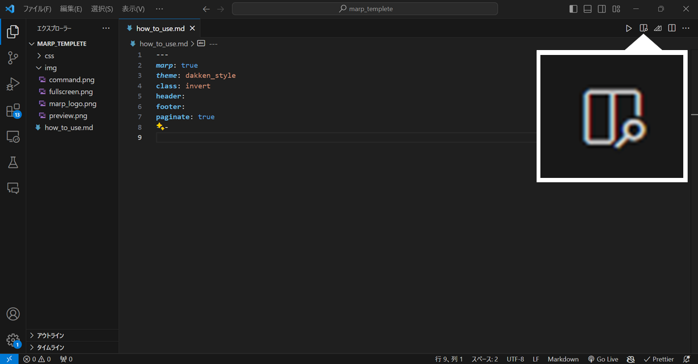

# <div class="title">Marp の使い方</div>


---

<!-- _class: invert mokuji -->

- # 目次

- #### Marp とは

- #### スライド作成の手順

- #### Markdown 記法のチートシート

- #### 参考にしたサイト

---

<!-- _class: invert mokuji -->

- # 目次

- ## **Marp とは**

- #### スライド作成の手順

- #### Markdown 記法のチートシート

- #### 参考にしたサイト

---

## Marp とは

#### Markdown からプレゼンスライドを作成することができるツールです．

#### PowerPoint などの グラフィカルなスライド作成ツールよりも自由度が低い分，安定して質の高いスライドを作成することができます．

#### CSS でスタイルを整えると，非常にオシャレなスライドをテンプレ化して作ることも可能になります．

<br>

<center>

| Document          | GitHub                            |
| ----------------- | --------------------------------- |
| https://marp.app/ | https://github.com/marp-team/marp |

</center>

---

### Markdown からのスライド生成には，以下のような利点があります．

- #### 一定品質のスライドがすぐできる

  - 普段使いのエディタで，箇条書きをするだけでスライドになる

- #### デザインとコンテンツを分離できる

  - 文書作成に集中できる
  - 調整が容易，かつ諦めがつく

- #### Git などでバージョン管理ができる

---

<!-- _class: invert mokuji -->

- # 目次

- #### Marp とは

- ## **スライド作成の手順**

- #### Markdown 記法のチートシート

- #### 参考にしたサイト

---

## スライド作成の手順

#### 1. VS Code の拡張機能で Marp for VS Code をインストール

<br>


---

#### 2. marp_templete.zip を解凍し，VS Code で開く．

<br>

<div class="split">
<center class="percent_45">


</center>

<div class="percent_10">
<br><br>
&emsp;<span style="font-size: 50px">→</span>
</div>

<center class="percent_45">


</center>
</div>

---

#### 3. 「Shift + Ctrl + P」でコマンドパレットから User Settings を開く．

##### 3-1. 「marp themes」を検索し，「項目の追加」から「css/dakken_style.css」を追加する．


##### 3-2.「marp html」を検索し，「Enable HTML」 にチェックを入れる．


---

#### 4. preview を見ながらファイルを編集する．

画面右上の preview ボタンをクリックすることで preview 画面が表示されます．

<center>



</center>

---

#### 5. スライドが完成したら，配布しやすいよう PDF に変換する．

画面右上の command ボタンをクリックして「Export Slide Deck」を選択し，任意のフォルダで PDF に変換します．

<center>


</center>

---

<!-- _class: invert mokuji -->

- # 目次

- #### Marp とは

- #### スライド作成の手順

- ## **Markdown 記法のチートシート**

- #### 参考にしたサイト

---

## Markdown 記法のチートシート

<br>

#### ハイフン( - )を 3 つ書くことで新しいページを作成することができます．

<div class="split">
<div class="percent_45">

```
page1

---

page2
```

</div>
<div class="percent_10">
<br>
<span style="font-size: 50px">→</span>
</div>
<div class="percent_45">

<div style="border-bottom: solid">
<center>page1</center>
<br>
</div>
<center style="margin-top: 30px">page2</center>
</div>
</div>

---

#### シャープ(#)で見出しを書くことができます．その大きさは#の個数で決まります．

<div class="split">
<div class="percent_45">
<br>

```
# 見出し 1

## 見出し 2

### 見出し 3

#### 見出し 4

##### 見出し 5

###### 見出し 6

####### 見出し 7 以降はないよ
```

</div>
<div class="percent_10" style="font-size: 70px">
<br><br>
→
</div>
<div class="percent_45">

# 見出し 1

## 見出し 2

### 見出し 3

#### 見出し 4

##### 見出し 5

###### 見出し 6

####### 見出し 7 以降はないよ

</div>
</div>

---

#### ハイフン( - )やアスタリスク( \* )で順序なしリストを作成できます．

<div class="split">
<div class="percent_45">

```
- list1
  - list1-1

* list2
```

</div>
<div class="percent_10">
<br>
<span style="font-size: 50px">→</span>
</div>
<div class="percent_45">

- list1
  - list1-1

* list2

</div>
</div>

<br>

#### 数字とピリオド( . )で順序付きリストを作成できます．

<div class="split">
<div class="percent_45">

```
1. list1
2. list2
```

</div>
<div class="percent_10">

<span style="font-size: 50px">→</span>

</div>
<div class="percent_45">

1. list1
2. list2

</div>
</div>

---

#### バッククォート( ` ) 3 つで囲むとコードブロックを作成できます．

また，以下のように言語の指定をすると，その言語のシンタックスハイライトが適用されます．

<div class="split">
<div class="percent_45">

````
```python
n = int(input())
s = input()

print(n, s)
```
````

</div>
<div class="percent_10">
<br>
<span style="font-size: 50px">→</span>

</div>
<div class="percent_45">

```python
n = int(input())
s = input()

print(n, s)
```

</div>
</div>

<br>

#### バッククォート( \` ) 1 つで囲むとコードスパンを作成できます．

<div class="split">
<div class="percent_45" style="margin-top: 10px">

```
Pythonは `print(a)` で出力
```

</div>
<div class="percent_10">

<span style="font-size: 50px">→</span>

</div>
<div class="percent_45" style="margin-top:20px">

Python は `print(a)` で出力

</div>
</div>

---

#### **\[リンクテキスト\]\(URL "タイトル"\)** で外部リンクを作成できます．

<div class="split">
<div class="percent_60" style="margin-right:60px">

```
[Google](https://google.com "Google Home")
```

</div>
<div class="percent_10">

<span style="font-size: 40px">→</span>

</div>
<div class="percent_20" style="margin-top:10px">

[Google](https://google.com "Google Home")

</div>
</div>

<br><br>

#### **\[リンクテキスト\]\(\#飛ばしたいページ番号\)** でページ内リンクを作成できます．

<div class="split">
<div class="percent_60" style="margin-right: 60px;">

```
[次のページ](#20)
```

</div>
<div class="percent_10">

<span style="font-size: 40px">→</span>

</div>
<div class="percent_20" style="margin-top:10px">

[次のページ](#20)

</div>
</div>

---

#### **!\[style\]\(表示したい画像への相対パス\)** で画像を表示できます．

<div class="split">
<div class="percent_60" style="margin-right: 60px;">
<br><br>

```

```

</div>
<div class="percent_10">
<br><br>
<span style="font-size: 50px">→</span>

</div>
<div class="percent_20">


</div>
</div>

---

<center>

#### **!\[bg style\]\(表示したい背景画像への相対パス\)** で背景画像を表示できます．

```

```

</center>


<br><br><br><br><br><br><br>

---

#### アスタリスク( \* ) 1 つで囲むと文字が強調されます．

<div class="split">
<div class="percent_55">

```
normal *em* normal
```

</div>
<div class="percent_10">

<span style="font-size: 50px">→</span>

</div>
<div class="percent_30" style="margin-top:15px">

normal _em_ normal

</div>
</div>

<br>

#### アスタリスク( \* ) 2 つで囲むと文字が強勢されます．

<div class="split">
<div class="percent_55">

```
normal **strong** normal
```

</div>
<div class="percent_10">

<span style="font-size: 50px">→</span>

</div>
<div class="percent_30" style="margin-top:15px">

normal **strong** normal

</div>
</div>

<br>

#### チルダ(~) 2 つで囲むと文字が打消しされます．

<div class="split">
<div class="percent_55">

```
normal ~~strikethrough~~ normal
```

</div>
<div class="percent_10">

<span style="font-size: 50px">→</span>

</div>
<div class="division_3" style="margin-top:15px">

normal ~~strikethrough~~ normal

</div>
</div>

---

#### 文頭に小なり記号(\>)を置くことで引用文が書けます．

<br>

<div class="split">
<div class="percent_45">

```
> これは引用文です．
>
>> さらに引用．
>>
>>> さらにさらに引用．
>>>
>>>> どこまでも引用．
```

</div>
<div class="percent_10">
<br><br>
<span style="font-size: 50px">→</span>

</div>
<div class="percent_45" style="padding-top: 20px">

> これは引用文です．
>
> > さらに引用．
> >
> > > さらにさらに引用．
> > >
> > > > どこまでも引用．

</div>
</div>

---

<style scoped>
    table { table-layout: fixed; font-size: 33px; width: 100%; display:table;  text-align: center; background-color: purple }
</style>

#### 縦線( | )とハイフン( - )でテーブルを作成できます．

<br>
<center>

```
| column1    | column2      | column3  | column4  |
| ---------- | ------------ | -------- | -------- |
| content1   | content2     | content3 | content4 |
| テーブルを  | つくることが  | できます  | 便利だね  |
```

<span style="font-size: 50px">↓</span>

| column1    | column2      | column3  | column4  |
| ---------- | ------------ | -------- | -------- |
| content1   | content2     | content3 | content4 |
| テーブルを | つくることが | できます | 便利だね |

</center>

---

<center>
<details>
<summary>他にも HTML のタグなどを利用すれば . . . </summary>

<br>
こんなオシャレなこともできるよ．

</details>
</center>

---

<!-- _class: invert mokuji -->

- # 目次

- #### Marp とは

- #### スライド作成の手順

- #### Markdown 記法のチートシート

- ## **参考にしたサイト**

---

## 参考にしたサイト(というかほぼパクリ)

- ### [【VS Code + Marp】Markdown から爆速・自由自在なデザインで、プレゼンスライドを作る](https://qiita.com/tomo_makes/items/aafae4021986553ae1d8)

- ### [Markdown 記法 チートシート Qiita](https://qiita.com/Qiita/items/c686397e4a0f4f11683d)

- ### []

---

<div class="anime_test"></div>
